# Tanvi Tiwari — Computer science and Engineering student, aspiring Software Engineer

I engineered a cross-browser extension for real-time claim verification, optimizing asynchronous API orchestration for sub-second latency. I also architected a four-layer ensemble detection pipeline that boosted fraud detection accuracy by 15% for Indian banks, processing 12 years of historical transaction data.

---

## Work

- **[FaultLine](https://github.com/just-tanvi/FaultLine)** — fraud detection ML model *(Python)*
- **[Cipher](https://github.com/just-tanvi/Cipher)** — AI powerd fact checking extension *(HTML)*

---

**Stack** &nbsp;—&nbsp; 

[Email](mailto:tanvitiwari0606@gmail.com) &nbsp;·&nbsp; [LinkedIn](https://linkedin.com/in/tanvi-tiwari-)

<picture>
  <source media="(prefers-color-scheme: dark)" srcset="output/mario-dark.svg">
  
</picture>
